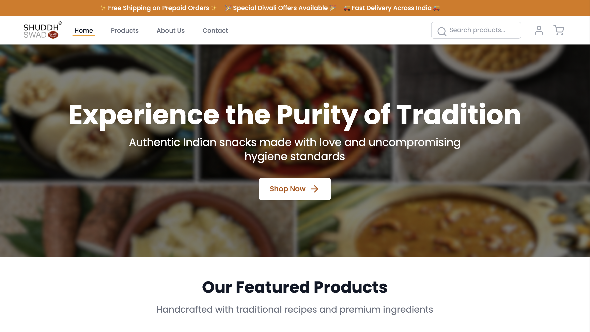
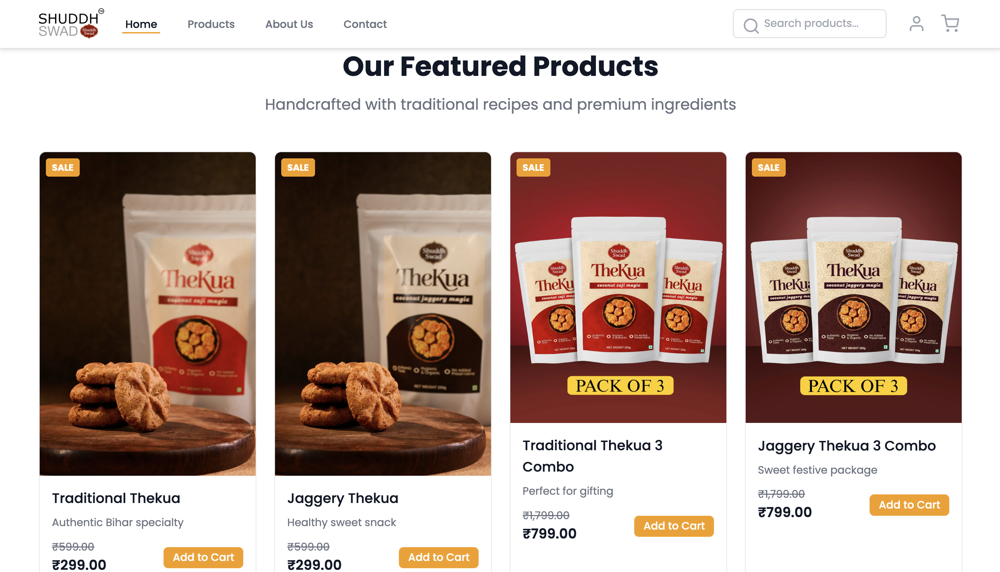

# 🍘 Shuddh Swad - Traditional Indian Snacks Website

A modern, responsive landing page for **Shuddh Swad**, showcasing authentic Indian traditional snacks with an elegant UI built using **HTML** and **CSS**.

---

## 🌐 Live Demo

👉 https://shuddh-swadd.netlify.app/

---

## 📸 Preview




---

## ✨ Features

- 🎨 Modern & Responsive UI
- 📱 Mobile Friendly Design
- ⚡ Tailwind CSS
- 🎭 Smooth Scroll Animations (AOS)
- 🛒 Product Showcase Section
- ⭐ Testimonials Section
- 💎 Clean & Minimal Design
- 🍪 Traditional Indian Snack Theme

---

## 🛠️ Built With

- HTML5
- Tailwind CSS (CDN)
- AOS Animation Library
- Feather Icons

---

## 📂 Project Structure

```
snacks-brand-clone/
│
├── images/
│   └── food12.png
│
├── index.html
├── README.md
└── .vscode/
```

---

## 📜 License

This project is created for educational and portfolio purposes.